# Create Auth Credentials on Amazon Web Services (AWS)

## Table of Contents
* [Overview](#overview)
* [Create an AWS User](#create-an-aws-user)
* [Create an AWS Policy](#create-an-aws-policy)
* [Attach the Policy to the User](#attach-the-policy-to-the-user)

## Overview

**Note:** This tutorial explains how to create auth credentials using the new updated AWS interface. If your AWS account has not been updated to the new interface, please follow instructions in the original article [here](https://stackpointcloud.com/community/tutorial/how-to-create-auth-credentials-on-amazon-web-services-aws---original-interface).

To create an Amazon Web Services (AWS) cluster through [StackPointCloud](stackpoint.io), you will need to:

1. Create an AWS user.
2. Create a policy which grants full access to:
  * Autoscaling
  * CloudWatch
  * EC2
  * Elastic Load Balancing
  * IAM
  * Route 53
3. Attach this policy to the user.

## Create an AWS User

To create a user, sign into [the AWS Management Console](https://console.aws.amazon.com/console/home) and click Services.

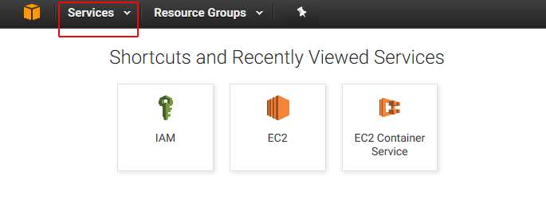

In the **Security, Identity & Compliance** column, click **IAM**.

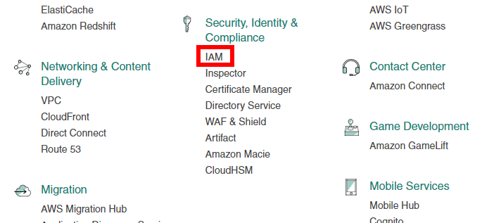

Click **Users**.

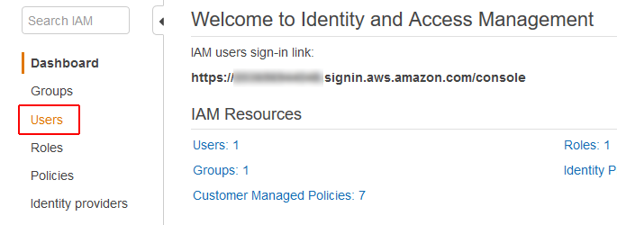

Click **Add User**.

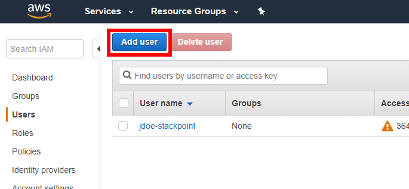

Enter the **User Name** then choose the **Access type.**

If this user will only be used to access the API, SDK, and other development tools, click **Programmatic access.** If this user is for someone who will need to log in to the AWS Management Console, choose **AWS Management Console access**.

Then click **Next: Permissions** to continue.

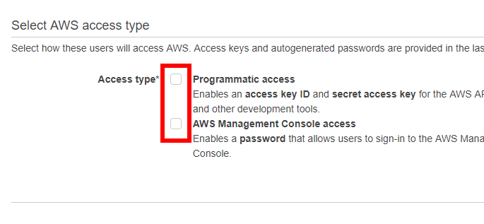

Choose whether to add the user to a group, copy permissions from an existing user, or attach existing policies directly.

Note: Amazon recommends using groups as a "best practice" way to manage user permissions.


If you need to create a new policy, see the next section for our recommended policy details.

If you choose to add the user to a group, you can either create a new group or select an existing group.

Then click **Next: Review** to continue.

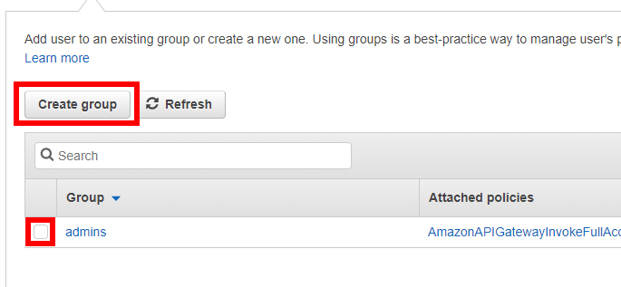

Confirm the new user's information, then click **Create user** to create the user.


Click **Download .csv** and save the user's security credentials to your computer.

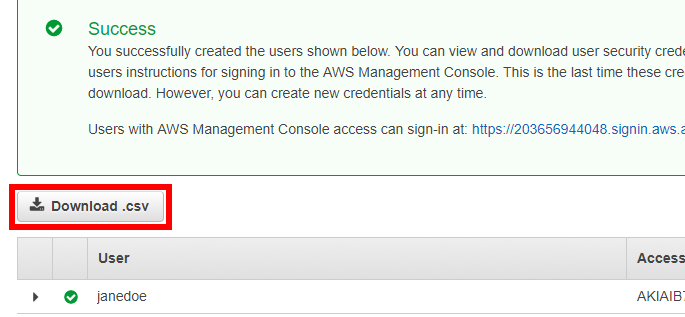

Then click **Close** to return to the **Users** page.

## Create an AWS Policy

When creating a new AWS policy, you will need to allow your user full access to the following services:

* Autoscaling
* CloudWatch
* EC2
* Elastic Load Balancing
* IAM
* Route 53

For an easy way to create a single policy to grant all the necessary access, click **Policies**. You can also access this page from the user account creation process by selecting **Attach existing policies directly > Create policy**.


Click **Create Policy**.

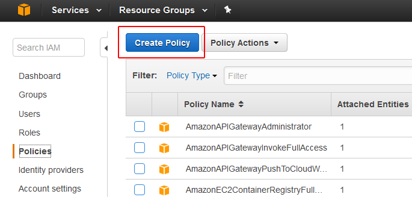

Click to select **Create Your Own Policy**.

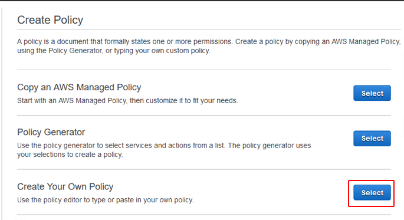

Fill out the **Policy Name** field with a name you will be able to identify, like `StackPointCloudPolicy`.

Note that you can only use alphanumeric characters plus a few other characters like `-` and `+`. You cannot use spaces in the policy name.

Copy the following and paste it into the **Policy Document** field:

```
{
    "Version": "2012-10-17",
    "Statement": [
        {
            "Action": "ec2:*",
            "Effect": "Allow",
            "Resource": "*"
        },
        {
            "Effect": "Allow",
            "Action": "elasticloadbalancing:*",
            "Resource": "*"
        },
        {
            "Effect": "Allow",
            "Action": "cloudwatch:*",
            "Resource": "*"
        },
        {
            "Effect": "Allow",
            "Action": "autoscaling:*",
            "Resource": "*"
        },
        {
            "Effect": "Allow",
            "Action": [
                "route53:*"
            ],
            "Resource": [
                "*"
            ]
        },
        {
            "Effect": "Allow",
            "Action": [
                "elasticloadbalancing:DescribeLoadBalancers"
            ],
            "Resource": [
                "*"
            ]
        },
        {
            "Effect": "Allow",
            "Action": "iam:*",
            "Resource": "*"
        }
    ]
}
```

Click **Create Policy** to create the policy and return to the Policy page.

## Attach the Policy to an Existing User

Click **Users** to return to the Users page.

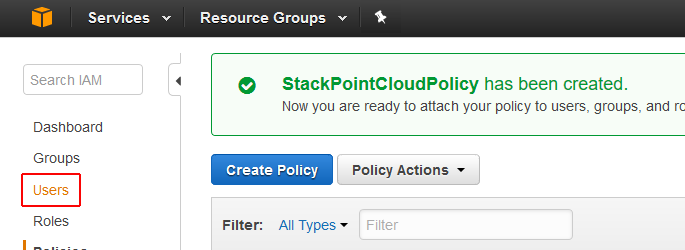

Click your user account to go to the user management page.

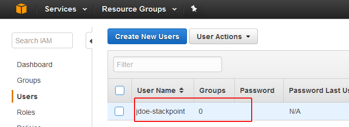

Click the **Permissions** tab, then click **Attach Policy**.


Type the name of your policy into the **Filter** field to locate your policy. Tick the box to select the policy, then click **Attach Policy** to attach it to your user.

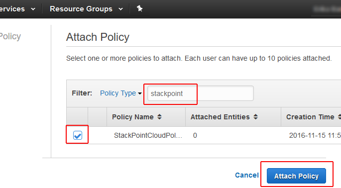

The user account is now ready to be used to create a cluster from [the StackPointCloud website](http://stackpoint.io). The user's Access Key ID and Secret Access Key are in the `credentials.csv` file which you downloaded when you created the user.
